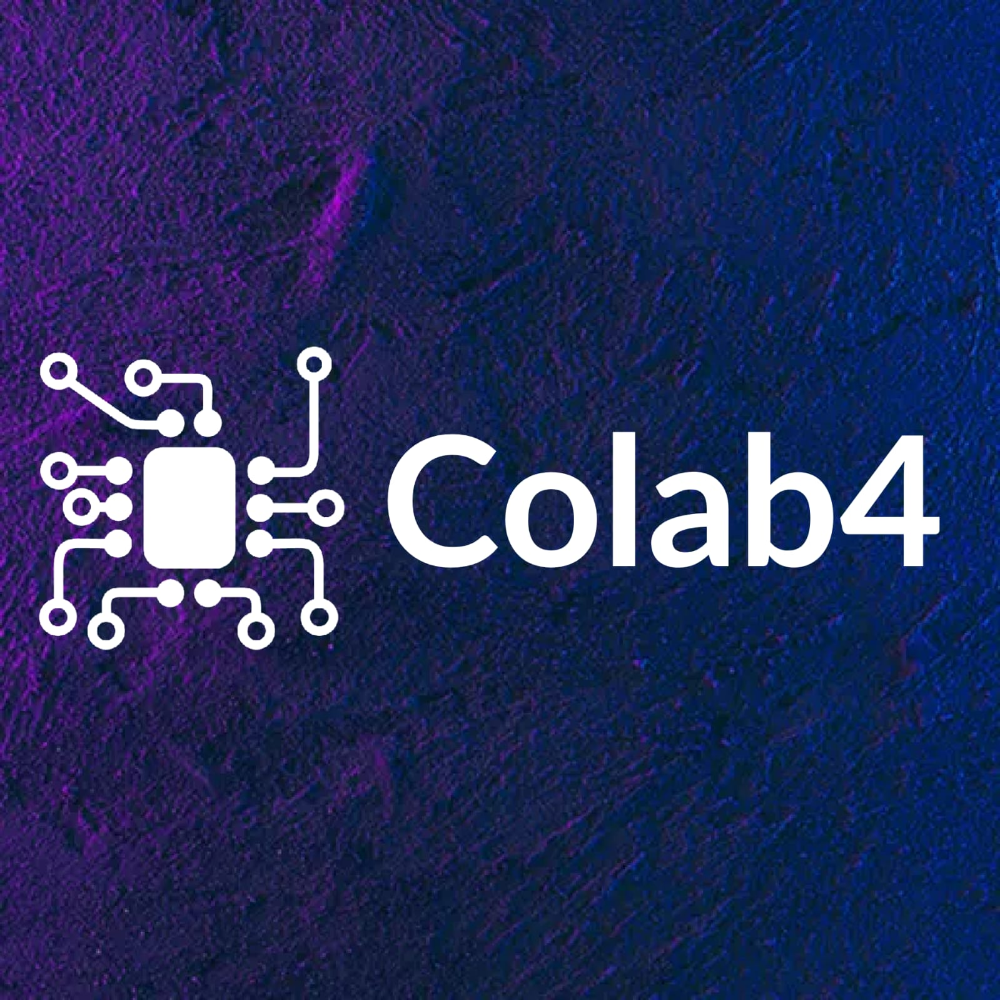

# Colab4

Estamos desenvolvendo um site de portfólio colaborativo que permite a criação e exibição de trabalhos de forma prática e personalizada. O site será responsivo e fácil de usar, focado em ajudar profissionais e estudantes a destacar suas habilidades e projetos online, facilitando a apresentação e o compartilhamento de suas conquistas.

## Tabela de Conteúdos
- [Demonstração](#demonstração)
<!-- - [Uso](#uso) -->
- [Contribuição](#contribuição)

- [Licença](#licença) 

## Demonstração

<!--  -->

##
